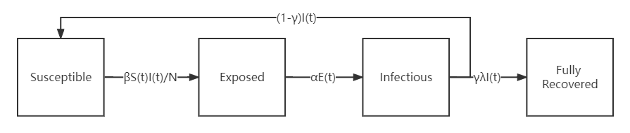
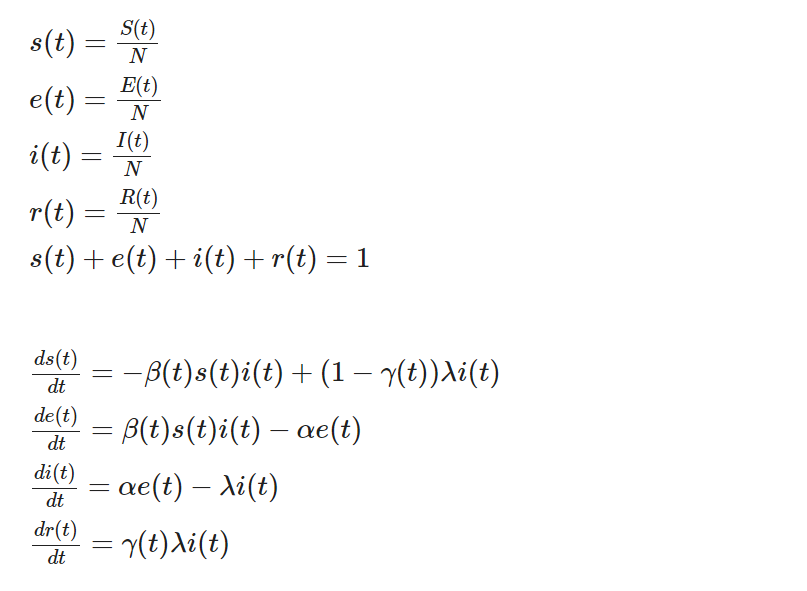

# Project proposal
Name: Shumeng Lin

## Summary of project

### Epidemic dynamics model
I want to create a python package of epidemic dynamics models. Those models can reflect the transmission of the disease, predict the future trend and help make decisions. 

There are several epidemic dynamics models and researchers are still making improvements to those models, such as SI, SIR, SEIR, SEIS and so on. This package will involve the SEIS model. New models can also be supplemented into the package. 

#### Example: SEIS model 
SEIS model divides the population into four compartments and the relationship between them is shown below:

* Susceptible means the subpopulation susceptible to acquire the disease;

* Exposed means the subpopulation that has been exposed to the disease but not yet infective;

* Infectious means the subpopulation that has become infective;

* Recovered means the subpopulation that has recovered from infection, and λ of them presumed to be no longer susceptible to the disease;

* β means the infection rate;

* α means the incubation rate;

* λ means the recover rate;

* γ means the fully recover rate;

* N means the total population.

For instance, the rate between susceptible and exposed means those percentage of susceptible people will turn to exposed people in certain time t.

The the realtionship and ode equations from SEIS model are shown below:

The lower case s, e, i, r here is the percentage of susceptible, exposed, infectious, and recovered respectively.

### Objectives

* Compute the amount of number in susceptible, exposed, infectious, recovered;

* Plot the trend given input parameters;

* Consider infection rate (β) and fully recover rate (γ) changing with time. For instance, at the begining, people are unaware of the disease, so the β will be large.

### Inside the package 

* The ode function to solve the model;

* The plot function to visualize the model;

* The export function to save the output.

## Tasks to be completed and timeline

* Complete the model functions, the plot function (before 4.17);

* Define the input parameters (before 4.20);

* Set up some tests and examples (before 4.24);

* Wrap up the package, add licenses, add setup (before 4.29).