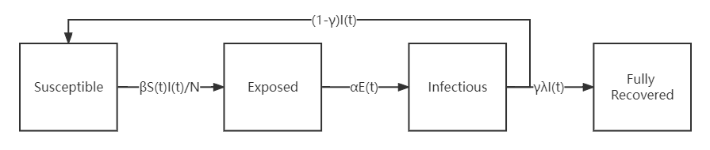

# Link to Deepnote

[Deepnote link](https://deepnote.com/project/project-54e4341f-8ca4-4cf3-830f-02a68e628053/%2Fproject-linshumeng%2Freadme.md)

# Introduction to the SEIS model

SEIS model is one of the epidemic dynamics models. It divides the population into four compartments and the relationship between them is shown below:

* Susceptible means the subpopulation susceptible to acquire the disease;

* Exposed means the subpopulation that has been exposed to the disease but not yet infective;

* Infectious means the subpopulation that has become infective;

* Recovered means the subpopulation that has recovered from infection, and λ of them presumed to be no longer susceptible to the disease;

* β means the infection rate;

* α means the incubation rate;

* λ means the recover rate;

* γ means the fully recover rate;

* N means the total population.

# Instruction to the package

The package is mainly used to get results of SEIS model by solving odes. 

The main function is [seis.py](./src/seis/seis.py). 

Examples with detailed coding work can be found in [example.ipynb](example.ipynb). 

## Inputs

Here, 6 arguments (4 positional arguments and 2 keyword arguments) should be passed into the function. 

The meaning of the inputs are shown below:

* n_pop: Toal population in the system;

* beta: The infection rate of the disease;

* gamma: The fully recover rate;

* tspan: The time span for the study;

* alpha: The incubation rate of the disease (default: 0.2), and 1/α is incubation period;

* lambda_rec: The recover rate of the disease (default: 1/7), and 1/λ is recover period.

There is no suggestion in the value of β, but there are some suggested [R0](https://en.wikipedia.org/wiki/Basic_reproduction_number#Sample_values_for_various_infectious_diseases)  = β·λ.

## Soloving ODE

### Initial Value

The initial value of the model is set as:

* s0 = 1 - e0 - i0 - r0;

* e0 = 0;

* i0 = 1/n_pop;

* r0 = 0.

It is a widely-accepted assumption, and you can change by editing below.

### Solver

The function used to solve the odes is [scipy.integrate.odeint](https://docs.scipy.org/doc/scipy/reference/generated/scipy.integrate.odeint.html).

## Result

There results can be either printed, plotted or exported as a .dat file. 

### Solution

The result are be generated from SEIS.solution(), the shape of which is (t, 4). t is the length of the time span. The 4 columns are the values of s, e, i, r.

### Plot

Plot can be generated from SEIS.plot(*args). Arguments should be passed into this function to tell which trend will be ploted. 

You can enter 's', 'e', 'i' 'r' or combination of them. Warning will be printed if other characters are passed into this function. 

### File(.dat)

Result file can be generated from SEIS.export(). The .dat file can be found in the path [result/result.dat](./result/result.dat). The new output will override the previous one, so remember to save the data.

If different path is prefered, you can change the lines here.

In the .dat file, there should be five columns, which are time, and the results of s, e, i, r respectively.

# Workflow

The test in workflow mainly deals with two problem. 

The first one is pytest, the existing of seis.py.

The second one is formatting test, and black, pylint and flake8 are involved.

# LICENSE

The license of this package is [GNU GENERAL PUBLIC LICENSE](./src/LICENSE).

# Future work

* Other epidemic dynamics models will be involved, e.g. SIR;

* Optimization functions will be imported to estimate the parameters, e.g. β;

* More flexibility in those functions.
